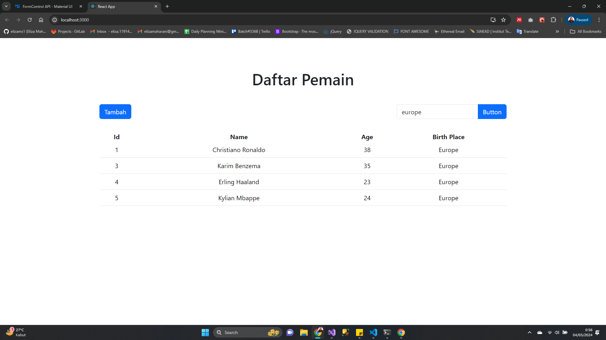
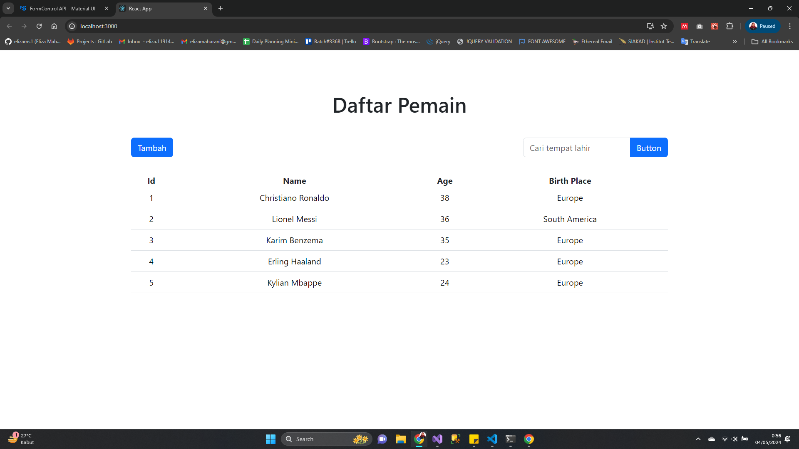
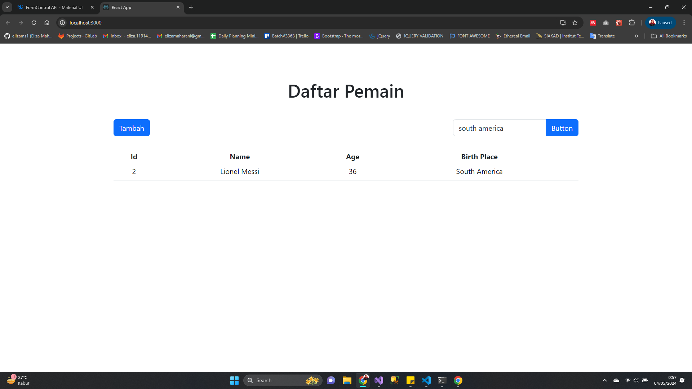
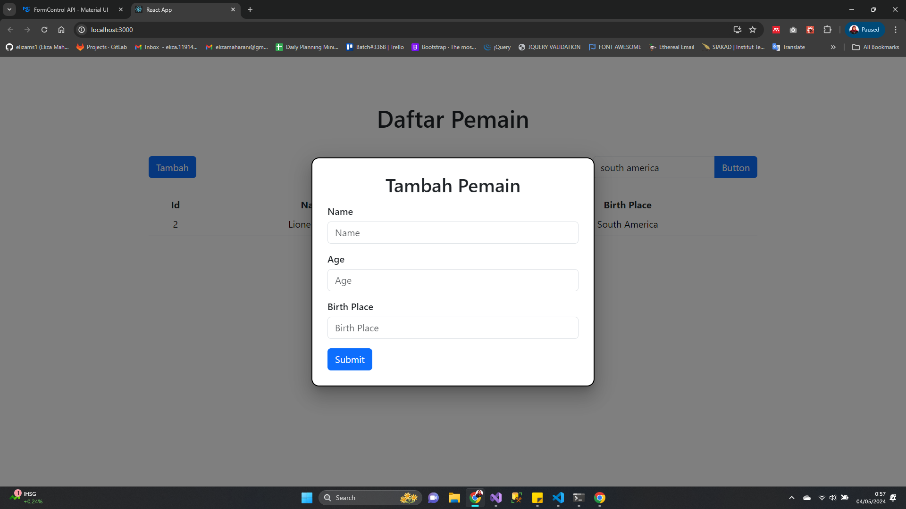

# Instruksi menjalankan web app

### 1. Clone dan jalankan terlebih dahulu API yang ada di repo sebelumnya
### 2. setelah di clone lakukan 
```npm i```
hal ini dilakukan untuk mendownload semua package yang digunakanseperti package bootstrap, axios, material ui
### 3. lakukan npm run
untuk menjalankan ketik ```npm run ``` pada terminal vs code setelahitu tampilan akan seperti ini








